# 나만 없어 집!

# 🚩 프로젝트 소개

### ✔️ **프로젝트 요약**

> **전국 아파트 매매 실거래 조회 서비스  “** 🏨 **나만 없어 집!”**

**SSAFY 8기** 대전 5반 3조
프로젝트 기간 : **2022.11.17 ~ 2022.11.24**

**아파트 매매 거래에** 관심이 많을 **예비 집주인 사용자**를 위해
**사용자 맞춤형** 부동산 정보와 **전국의** **아파트 매매 실거래** **정보**를 제공하고,
**커뮤니티 게시판**을 통해 **부동산 소식을 공유**하는 서비스
> 

### ✔️ Developers

| https://github.com/seoyoon528 | https://github.com/wjdwn03 |
| --- | --- |
| 박서윤 | 황정주 |

### ✔️ Architecture

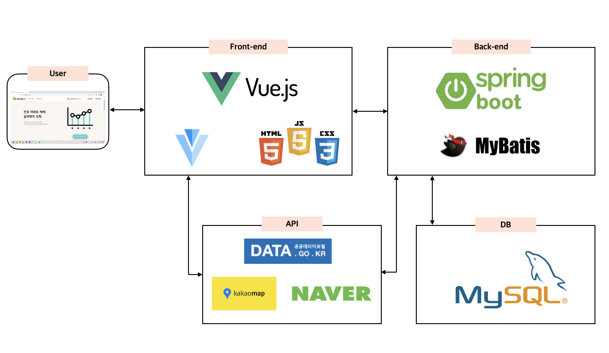

### ✔️ 개발 환경

| 개발 환경 (IDE) |  STS, Visual Studio Code |
| --- | --- |
| 개발 언어 | Java, JavaScript, HTML, CSS |
| 데이터베이스 | MySql |
| 프레임워크 | SpringFrameWork.Boot, Maven, MyBatis
Vue.js, Vuex, Vuetify |

### ✔️ 사용한 API

- **공공 데이터 포털 > 국토교통부 아파트 실거래가 자료**
    
    [https://www.data.go.kr/iim/api/selectAPIAcountView.do](https://www.data.go.kr/iim/api/selectAPIAcountView.do)
    
- **카카오 MAP API**
    
    [Kakao 지도 API](https://apis.map.kakao.com/web/)
    

- **네이버 검색 API**
    
    [https://developers.naver.com/products/service-api/search/search.md](https://developers.naver.com/products/service-api/search/search.md)
    

# 🖼 WireFrame

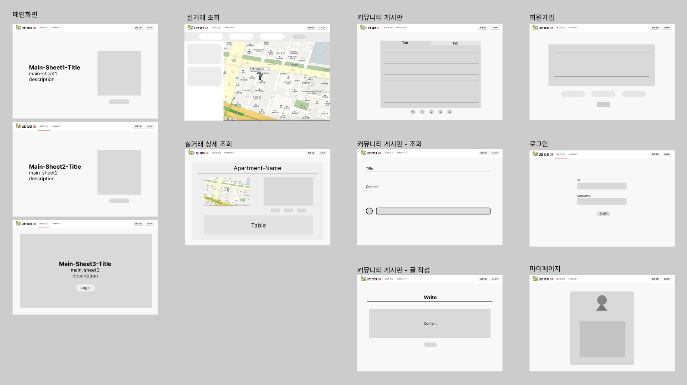

## **💾** ERD

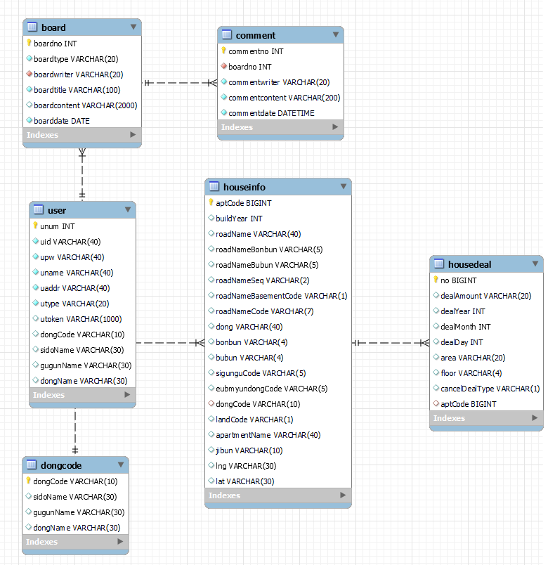

## **💾** 사용한 데이터베이스

---

- **[ houseinfo ]** - 아파트 정보 테이블
    
    
    |  | 아파트번호 | 건축년도 | 도로명 | 도로명본분 | 도로명부분 | 도로명seq | 도로명지번코드 | 도로명코드 | 동이름 | 본분 | 부분 | 시구군코드 | eubmyundongCode | 동코드 | 토지코드 | 아파트이름 | 지번 | 경도 | 위도 |
    | --- | --- | --- | --- | --- | --- | --- | --- | --- | --- | --- | --- | --- | --- | --- | --- | --- | --- | --- | --- |
    | 컬럼명 | aptCode | aptName | roadName | roadNameBonbun | roadNameBubun | roadNameSeq | roadNameBasementCode | roadNameCode | dong | bonbun | bubun | sigunguCode | eubmyundongCode | dongCode | landCode | apartmentName | jibun | lng | lat |
    | 데이터타입 | bigint | int | varchar(40) | varchar(5) | varchar(5) | varchar(2) | varchar(1) | varchar(7) | varchar(40) | varchar(4) | varchar(4) | varchar(5) | varchar(5) | varchar(10) | varchar(1) | varchar(40) | varchar(10) | varchar(30) | varchar(30) |
    | Constraint | primary key | default null | default null | default null | default null | default null | default null | default null | default null | default null | default null | default null | default null | default null | default null | default null | default null | default null | default null |
    |  |  |  |  |  |  |  |  |  |  |  |  |  |  | foreign key |  |  |  |  |  |
    |  |  |  |  |  |  |  |  |  |  |  |  |  |  |  |  |  |  |  |  |
    
    ```sql
    CREATE TABLE `houseinfo` (
      `aptCode` bigint NOT NULL,
      `buildYear` int DEFAULT NULL,
      `roadName` varchar(40) DEFAULT NULL,
      `roadNameBonbun` varchar(5) DEFAULT NULL,
      `roadNameBubun` varchar(5) DEFAULT NULL,
      `roadNameSeq` varchar(2) DEFAULT NULL,
      `roadNameBasementCode` varchar(1) DEFAULT NULL,
      `roadNameCode` varchar(7) DEFAULT NULL,
      `dong` varchar(40) DEFAULT NULL,
      `bonbun` varchar(4) DEFAULT NULL,
      `bubun` varchar(4) DEFAULT NULL,
      `sigunguCode` varchar(5) DEFAULT NULL,
      `eubmyundongCode` varchar(5) DEFAULT NULL,
      `dongCode` varchar(10) DEFAULT NULL,
      `landCode` varchar(1) DEFAULT NULL,
      `apartmentName` varchar(40) DEFAULT NULL,
      `jibun` varchar(10) DEFAULT NULL,
      `lng` varchar(30) DEFAULT NULL,
      `lat` varchar(30) DEFAULT NULL,
      PRIMARY KEY (`aptCode`),
      UNIQUE KEY `UNIQUE` (`buildYear`,`apartmentName`,`jibun`,`sigunguCode`,`eubmyundongCode`) /*!80000 INVISIBLE */,
      KEY `houseinfo_dongCode_dongcode_dongCode_fk_idx` (`dongCode`) /*!80000 INVISIBLE */,
      CONSTRAINT `houseinfo_dongCode_dongcode_dongCode_fk` FOREIGN KEY (`dongCode`) REFERENCES `dongcode` (`dongCode`)
    ) ENGINE=InnoDB DEFAULT CHARSET=utf8mb4 COLLATE=utf8mb4_0900_ai_ci;
    ```
    
- **[ housedeal ]** - 아파트 매매 정보 테이블
    
    
    |  | 매매번호 | 거래금액 | 거래년도 | 거래월 | 거래일 | 면적 | 층 |  | 아파트코드 |
    | --- | --- | --- | --- | --- | --- | --- | --- | --- | --- |
    | 컬럼명 | no | dealAmount | dealYear | dealMonth | dealDay | area | floor | cancelDealType | aptCode |
    | 데이터타입 | bigint | varchar(20) | int | int | int | varchar(20) | varchar(4) | varchar(1) | bigint |
    | Constraint |  |  |  |  |  |  |  |  | primary key |
    |  | default null | default null | default null | default null | default null | default null | default null | default null | default null |
    |  |  |  |  |  |  |  |  |  | foreign key |

```sql
CREATE TABLE `housedeal` (
  `no` bigint NOT NULL,
  `dealAmount` varchar(20) DEFAULT NULL,
  `dealYear` int DEFAULT NULL,
  `dealMonth` int DEFAULT NULL,
  `dealDay` int DEFAULT NULL,
  `area` varchar(20) DEFAULT NULL,
  `floor` varchar(4) DEFAULT NULL,
  `cancelDealType` varchar(1) DEFAULT NULL,
  `aptCode` bigint DEFAULT NULL,
  PRIMARY KEY (`no`),
  KEY `housedeal_aptCode_houseinfo_aptCode_fk_idx` (`aptCode`),
  CONSTRAINT `housedeal_aptCode_houseinfo_aptCode_fk` FOREIGN KEY (`aptCode`) REFERENCES `houseinfo` (`aptCode`)
) ENGINE=InnoDB DEFAULT CHARSET=utf8mb4 COLLATE=utf8mb4_0900_ai_ci;
```

- **[ dongcode]** - 전국의 동 코드
    
    
    |  | 동코드 | 시/도 이름 | 구/군 이름 | 동 이름 |
    | --- | --- | --- | --- | --- |
    | 컬럼명 | dongCode | sidoName | gugunName | dongName |
    | 데이터타입 | varchar(10) | varchar(30) | varchar(30) | varchar(30) |
    | Constraint | not null | default null | default null | default null |
    |  | primary key |  |  |  |
    
    ```sql
    CREATE TABLE `dongcode` (
      `dongCode` varchar(10) NOT NULL,
      `sidoName` varchar(30) DEFAULT NULL,
      `gugunName` varchar(30) DEFAULT NULL,
      `dongName` varchar(30) DEFAULT NULL,
      PRIMARY KEY (`dongCode`)
    ) ENGINE=InnoDB DEFAULT CHARSET=utf8mb4 COLLATE=utf8mb4_0900_ai_ci;
    ```
    

- **[ user ] -** 회원 정보 테이블
    
    
    |  | 회원번호 | 회원아이디 | 회원비밀번호 | 회원이름 | 회원주소 | 회원 타입 | 사용자 확인 토큰 | 관심 지역 - 동코드 | 관심 지역 - 시/도 | 관심 지역 - 구/군 | 관심 지역 - 동 |
    | --- | --- | --- | --- | --- | --- | --- | --- | --- | --- | --- | --- |
    | 컬럼명 | unum | uid | upw | uname | uaddr | utype | utoken | dongCode | sidoName | gugunName | dongName |
    | 데이터타입 | int (auto_increment) | varchar(40) | varchar(40) | varchar(40) | varchar(40) | varchar(20) | varchar(1000) | varchar(10) | varchar(30) | varchar(30) | varchar(30) |
    | Constraint | primary key | unique  | not null | not null | not null | not null | default null | default null | default null | default null | default null |
    |  |  | not null |  |  |  |  |  |  |  |  |  |
    
    ```sql
    CREATE TABLE `user` (
      `unum` int NOT NULL AUTO_INCREMENT,
      `uid` varchar(40) NOT NULL,
      `upw` varchar(40) NOT NULL,
      `uname` varchar(40) NOT NULL,
      `uaddr` varchar(40) NOT NULL,
      `utype` varchar(20) NOT NULL,
      `utoken` varchar(1000) DEFAULT NULL,
      `dongCode` varchar(10) DEFAULT NULL,
      `sidoName` varchar(30) DEFAULT NULL,
      `gugunName` varchar(30) DEFAULT NULL,
      `dongName` varchar(30) DEFAULT NULL,
      PRIMARY KEY (`unum`),
      UNIQUE KEY `uid` (`uid`)
    ) ENGINE=InnoDB AUTO_INCREMENT=38 DEFAULT CHARSET=utf8mb4 COLLATE=utf8mb4_0900_ai_ci
    ```
    

- **[ board ]** - 게시판 테이블
    
    
    |  | 게시글번호 | 게시글 작성자 타입 | 게시글작성자 | 게시글제목 | 게시글내용 | 게시글작성일시 |
    | --- | --- | --- | --- | --- | --- | --- |
    | 컬럼명 | boardno | boardtype | boardwriter | boardtitle | boardcontent | boarddate |
    | 데이터타입 | int (auto_increment) | varchar(20) | varchar(20) | varchar(100) | varchar(200) | date |
    | Constraint | primary key | not null | foreign key (references userinfo(userid)) | not null | default null | not null |
    |  |  |  | on delete cascade |  |  |  |
    
    ```sql
    create table board (
        boardno int auto_increment,
        boardtype varchar(20) not null,
        boardwriter varchar(20) not null,
        boardtitle varchar(100) not null,
        boardcontent varchar(200) DEFAULT null,
        boarddate date not null,
        primary key (`boardno`),
        foreign key (`boardwriter`) references `user`(`uid`)
        on delete cascade
    );
    ```
    

- **[ comment] -** 댓글 테이블
    
    
    |  | 댓글 번호 | 게시글 번호 | 댓글 작성자 | 댓글 내용 | 댓글 작성일시 |
    | --- | --- | --- | --- | --- | --- |
    | 컬럼명 | commentno | boardno | commentwriter | commentcontent | commentdate |
    | 데이터타입 | int (auto_increment) | int | varchar(20) | varchar(200) | datetime |
    | Constraint | primary key | foreign key (references board(boardno) | not null | not null | not null |
    |  |  | on delete cascade |  |  |  |

```sql
CREATE TABLE `comment` (
  `commentno` int NOT NULL AUTO_INCREMENT,
  `boardno` int NOT NULL,
  `commentwriter` varchar(20) NOT NULL,
  `commentcontent` varchar(200) NOT NULL,
  `commentdate` datetime NOT NULL,
  PRIMARY KEY (`commentno`),
  KEY `boardno` (`boardno`),
  CONSTRAINT `comment_ibfk_1` FOREIGN KEY (`boardno`) REFERENCES `board` (`boardno`) ON DELETE CASCADE
) ENGINE=InnoDB AUTO_INCREMENT=86 DEFAULT CHARSET=utf8mb4 COLLATE=utf8mb4_0900_ai_ci
```

## 🗂 프로젝트 구성

---

[ **주택 관련 정보 ]**

- DTO
    - HouseInfoDTO.java
    - HouseDealDTO.java
    - DonCodeDTO.java
    - BaseAddressDTO.java
    - AptTop3DTO.java
- DAO
    - HouseMapper.java
    - HouseMapper.xml
- Service
    - HouseService.java
- Controller
    - HouseController.java
    - NaverController.java
- Vue
    - HouseDeal.vue
    - HouseDealDetail.vue
    - MapInit.vue  ⇒  카카오맵 api 관련 vue
    - NaverNews.vue ⇒ 네이버 뉴스 api 관련 vue
    

**[ 사용자 정보 ]**

- DTO
    - UserDTO.java
- DAO
    - UserMapper.java
    - UserMapper.xml
- Service
    - UserService.java
    - JwtService.java
- Controller
    - UserController.java
- Vue
    - MyPage.vue
    - SignUp.vue
    - UserLogin.vue
    - UserModify.vue

**[ 게시판 ]**

- DTO
    - BoardDTO.java
    - CommentDTO.java
- DAO
    - BoardMapper.java
    - BoardMapper.xml
- Service
    - BoardService.java
- Controller
    - BoardController.java
    - FileController.java
- Vue
    - BoardComment.vue
    - BoardList.vue
    - BoardListItem.vue
    - BoardUpdate.vue
    - BoardWrite.vue
    

**[ Config ]**

- DatabaseConfig.java
- JwtConfiguration.java
- SwaggerConfiguration.java
- UnAuthorizedException.java

**[ include ]**

- Vue
    - FooterBar.vue
    - Header.vue
- js
    - router/index.js
    - store/index.js
    - util/http-common.js

### 🗂 Class Diagram

- **Spring & Vue**

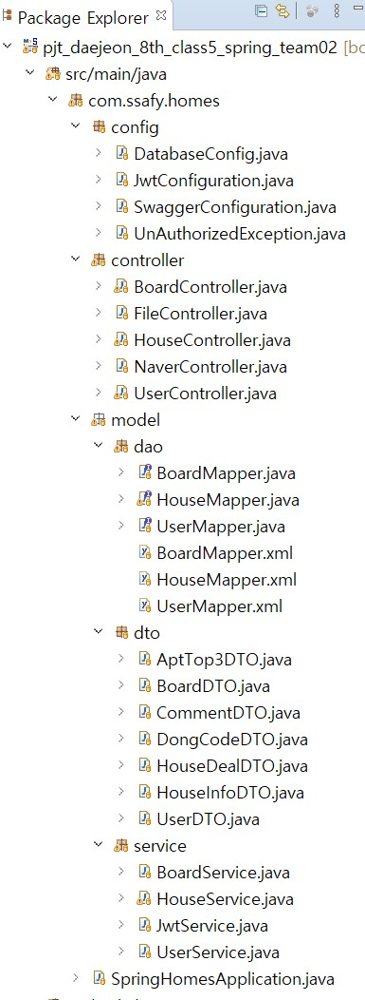

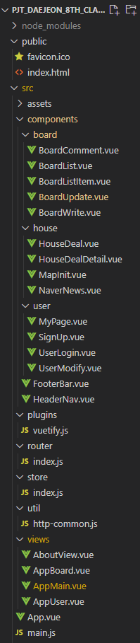

[ **주택   ]**

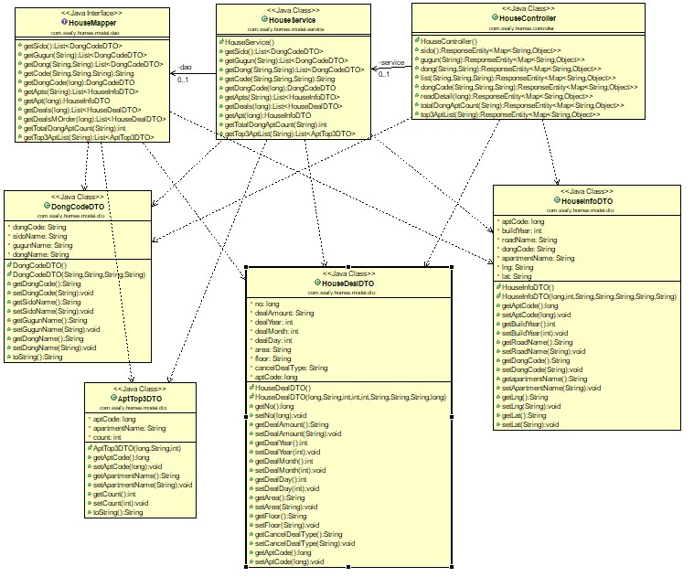

**[ 게시판 ]**

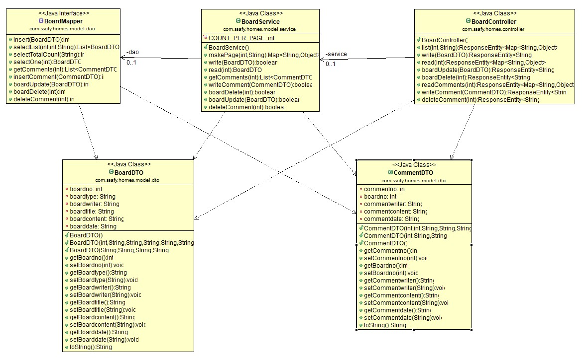

**[ 사용자 ]**

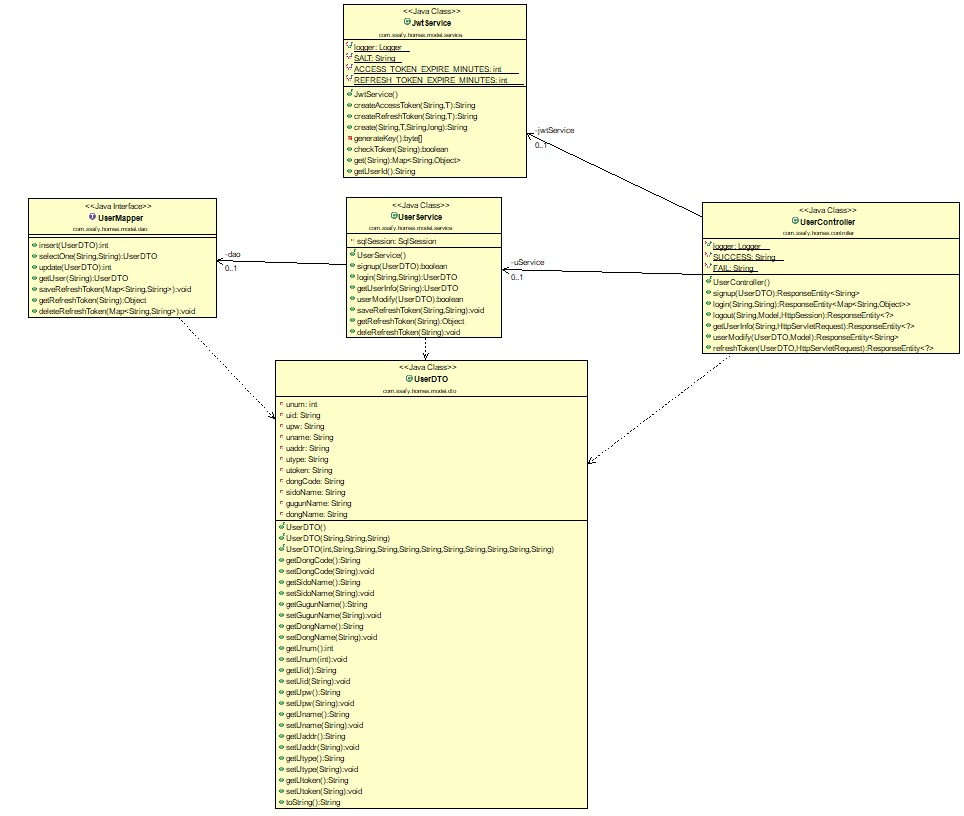

**[ 기타 ]**

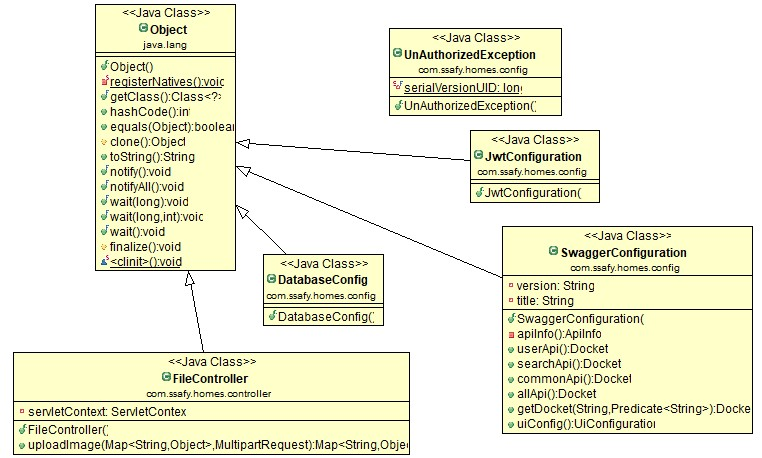

### 🗂 Usecase Diagram

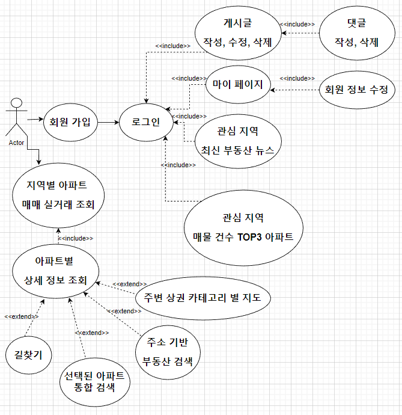

# 📎 기능 요약

### ✔️ house

- **지역별 아파트 매매 실거래 정보 조회**
    - 매매 실거래 내역이 있는 아파트 정보 표시
    - 조회된 아파트 위치 맵에 마커로 표시
    
- **조회된 아파트 상세 정보 조회**
    - 조회된 아파트 매매 실거래 내역 표시
    - 조회된 아파트 주변 상권 카테고리별 표시
    - 조회된 아파트를 목적지로 길찾기
    - 조회된 아파트 통합 검색
    - 조회된 아파트 주변 부동산 검색
    
- **사용자의 관심 지역 맞춤 부동산 정보**
    - 사용자 관심 지역의 총 아파트 매매 실거래 건수 표시
    - 사용자 관심 지역의 매매 실거래 건수 TOP3 아파트 상세 정보 표시
    - 사용자 관심 지역의 부동산 뉴스

### ✔️ user

- **회원 가입**
    - 회원 가입 시 기본 정보와 관심 지역을 선택
- **로그인**
    - JWT를 이용한 로그인
- **마이 페이지**
- **회원 정보 수정**

### ✔️ board

- **일반 게시판**
    - 모든 종류의 글을 작성하는 게시판
    - 게시글 작성, 조회, 댓글 작성
        - 모든 사용자 접근 가능
    
- **홍보 게시판**
    - 홍보 목적의 게시판
    - 글 작성
        - User Type이 부동산 종사자인 경우에만 가능
    - 게시글 조회, 댓글 작성
        - 모든 사용자 가능

# 🌟 기능 상세 설명

### ✔️ house

- **지역별 아파트 매매 실거래 정보 조회**
    - 사용자가 시/도 > 구/군 > 동 순으로 지역을 선택하면 **Vuex**를 이용해 비동기로 선택한 지역의 매매 실거래 내역이 있는 아파트 리스트 데이터를 가져온다.
        
        (사용자가 선택한 시/도 데이터를 바탕으로 **비동기 방식**으로 구/군 데이터를 받아오고, 구/군 데이터를 바탕으로 동 정보를 받아오므로 연쇄적으로 동작한다.)
        
    - 리스트의 아파트 데이터들의 간단한 정보와 함께 맵에 마커로 위치를 표시한다.
    
    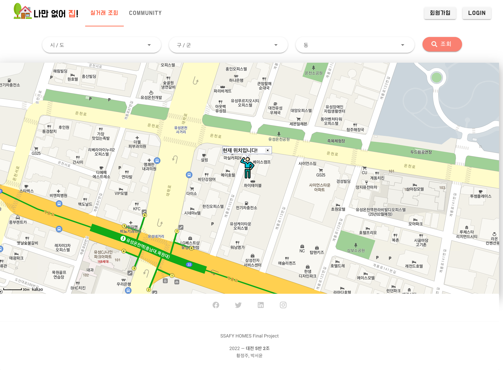
    
    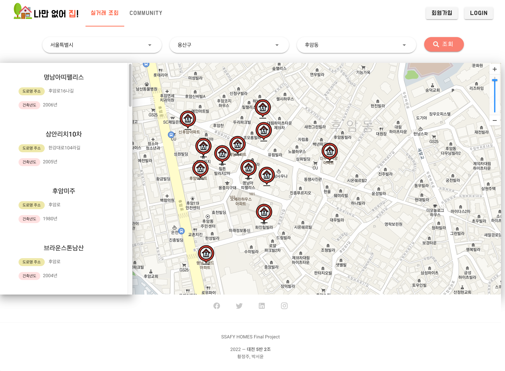

    ```jsx
    actions: {
    	getSidoList({ commit }) {
          console.log("Sido index.js 넘어옴");
          http
            .get("house/sido")
            .then((resp) => {
              console.log("index.js 넘어옴", resp.data);
              commit("SET_SIDO_LIST", resp.data);
            })
            .catch((error) => {
              console.log(error);
            });
        },
    
        getGugunList({ commit }, sidoCodeVal) {
          console.log("Gugun index.js 넘어옴");
          http
            .get("house/gugun?sido=" + sidoCodeVal)
            .then((resp) => {
              commit("SET_GUGUN_LIST", resp.data);
            })
            .catch((error) => {
              console.log(error);
            });
        },
    
        getDongList({ commit }, { sidoCodeVal, gugunCodeVal }) {
          console.log("Dong index.js 넘어옴");
          http
            .get("house/dong?sido=" + sidoCodeVal + "&gugun=" + gugunCodeVal)
            .then((resp) => {
              commit("SET_DONG_LIST", resp.data);
            })
            .catch((error) => {
              console.log(error);
            });
        },
    
        getAptList({ commit }, { sidoCodeVal, gugunCodeVal, dongCodeVal }) {
          console.log("House index.js 넘어옴");
          http
            .get("house/list?sido=" + sidoCodeVal + "&gugun=" + gugunCodeVal + "&dong=" + dongCodeVal)
            .then((resp) => {
              commit("SET_APT_LIST", resp.data);
            })
            .catch((error) => {
              console.log(error);
            });
        },
    },
    ```
    

- **조회된 아파트 상세 정보 조회**
    - 아파트 리스트 중 하나를 클릭 시 해당 아파트의 상세 정보를 조회할 수 있다.
    - 해당 아파트의 매매 거래 내역 중 면적 데이터를 모두 받아와 평균 면적을 구해 함께 표시한다.
    - 상세 정보 조회 시 해당 아파트 매매 거래 정보와 더불어 주변 상권 조회, 길찾기, 포털 사이트에 종합 검색, 주변 부동산 조회 기능 등을 제공한다.
    
    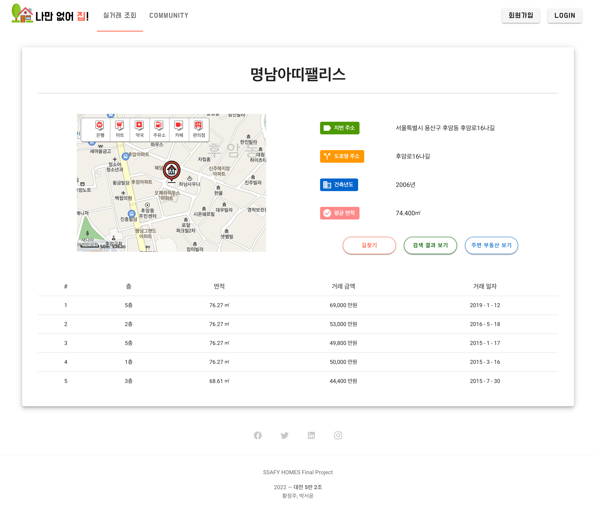
    
    1) 조회된 **아파트 주변 상권** **카테고리별 표시**
    
    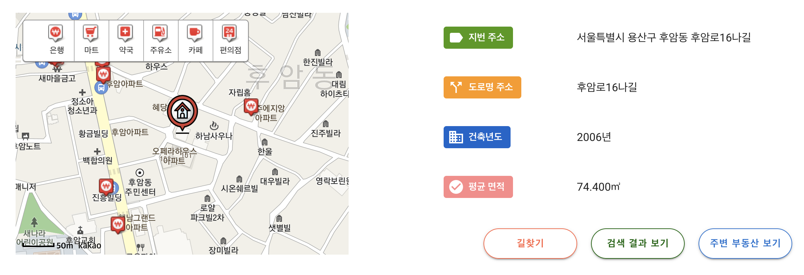
    
    2) 조회된 아파트를 **목적지로 길찾기**
    
    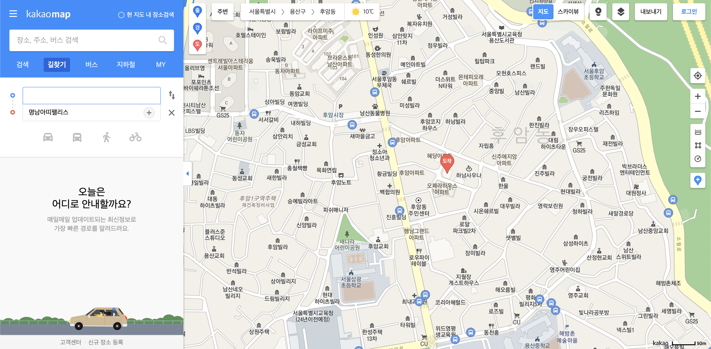
    
    3) 조회된 아파트 **통합 검색**
    
    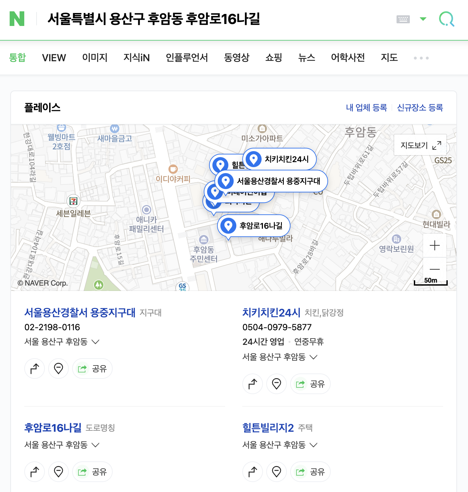
    
    4) 조회된 아파트 **주변 부동산** 검색
    
    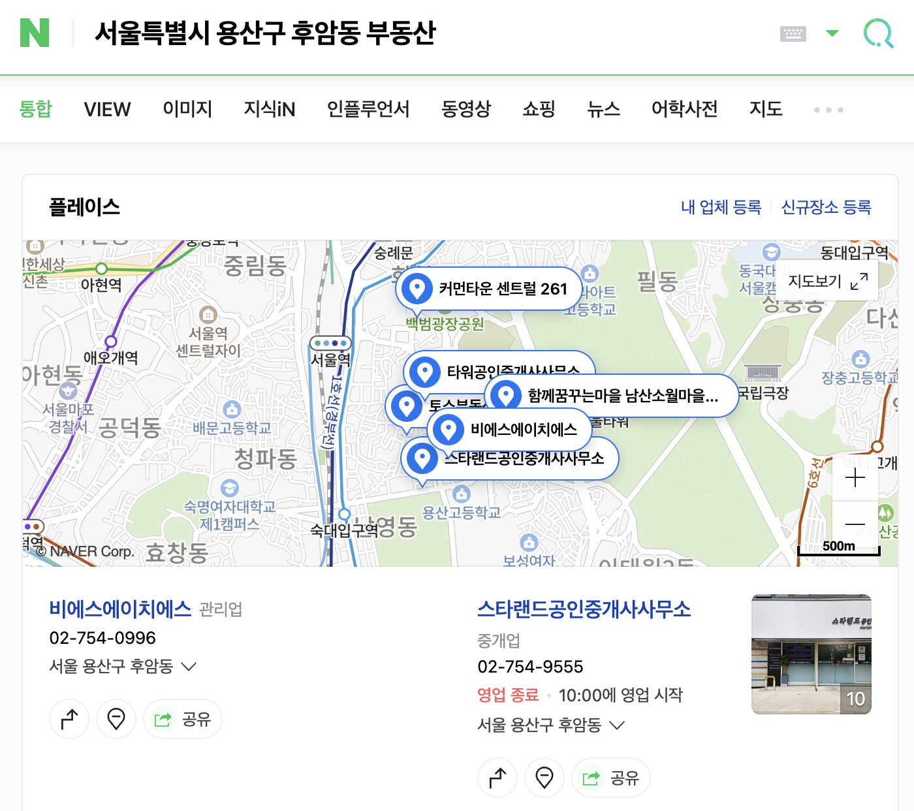
    
    ```jsx
    getAptItem({ commit }, aptCode) {
          console.log("HouseItem index.js 넘어옴");
          console.log("AptCode", aptCode);
          http
            .get("house/detail?aptcode=" + aptCode)
            .then((resp) => {
              console.log(resp.data);
              commit("SET_APT_ITEM", resp.data);
            })
            .catch((error) => {
              console.log(error);
            });
        },
    ```
    
- **사용자의 관심 지역 맞춤 부동산 정보**
    - 로그인을 하지 않으면 사용자 맞춤형 부동산 정보 서비스는 이용할 수 없다.
    - 회원가입 시 등록한 회원의 관심 지역 데이터를 가공해 맞춤형 부동산 정보를 보여준다.
    
    **[ 로그인 하지 않은 상태 ]**
    
    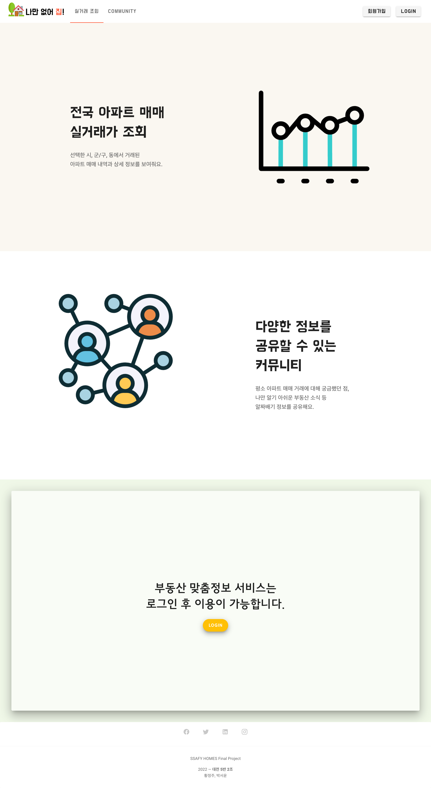
    
    **[ 로그인 한 상태 ]**
    
    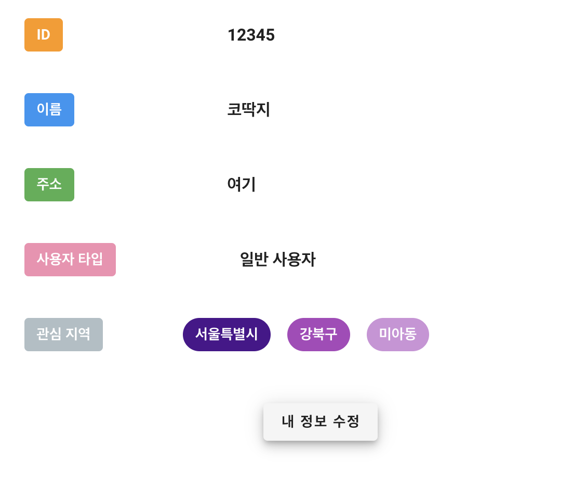
    
    - 로그인이 되어있다면, 사용자의 관심 지역의 총 아파트 매매 실거래 건수를 구하고, 거래량이 가장 많은 아파트 3개를 상세정보를 카드 형식으로 보여준다.
    - 사용자 관심 지역의 부동산 뉴스를 실시간으로 불러와 보여준다.
    
    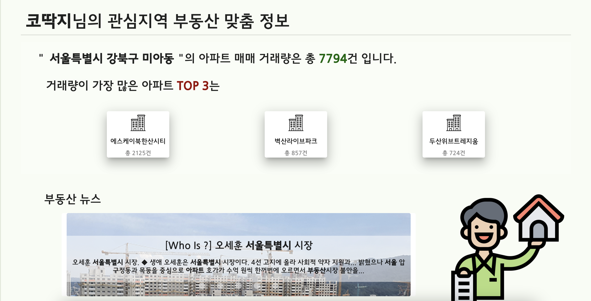
    
    - 각각의 아이템을 클릭하면 클릭한 아파트의 상세 정보를 dialog 창으로 띄워준다.
    
    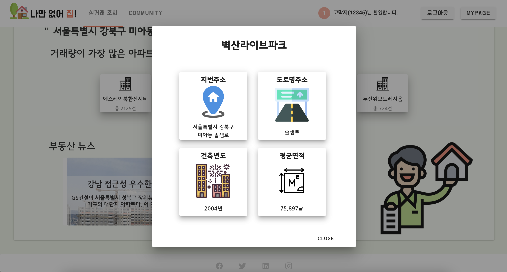
    

```xml
<select id="getTotalDongAptCount" parameterType="String" resultType="int">
	select count(*)
	from houseinfo join housedeal
	on houseinfo.aptCode = housedeal.aptCode
	where dongCode = #{dongCode};
</select>

<select id="getTop3AptList" parameterType="String" resultType="com.ssafy.homes.model.dto.AptTop3DTO">
	select houseinfo.aptCode as aptCode, apartmentName, count(*) as count
	from houseinfo join housedeal
	on houseinfo.aptCode = housedeal.aptCode
	where dongCode = #{dongCode}
	group by houseinfo.aptCode
	order by count(*) desc
	limit 0, 3;
</select>
```

### ✔️ user

- **회원 가입**
    
    
    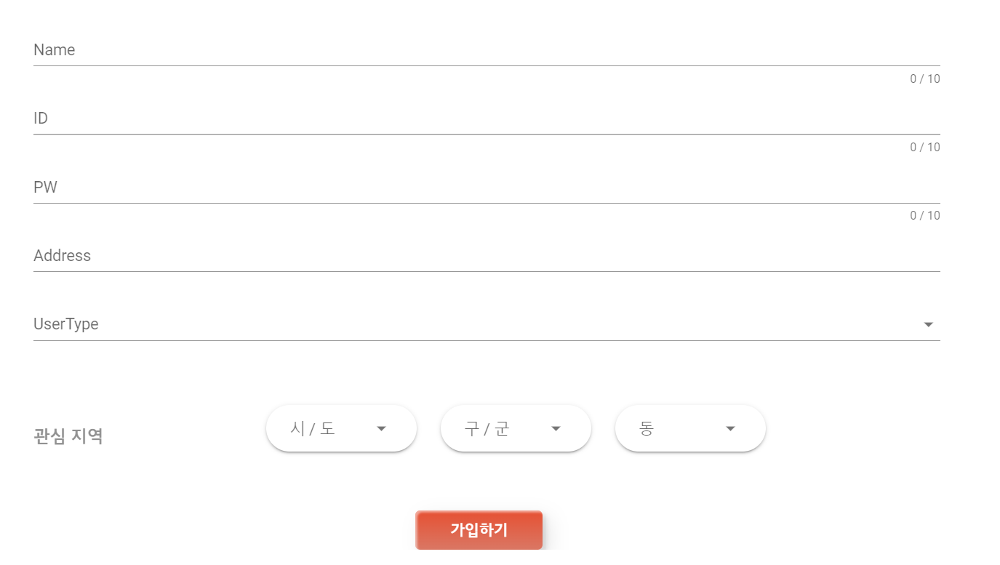
    
    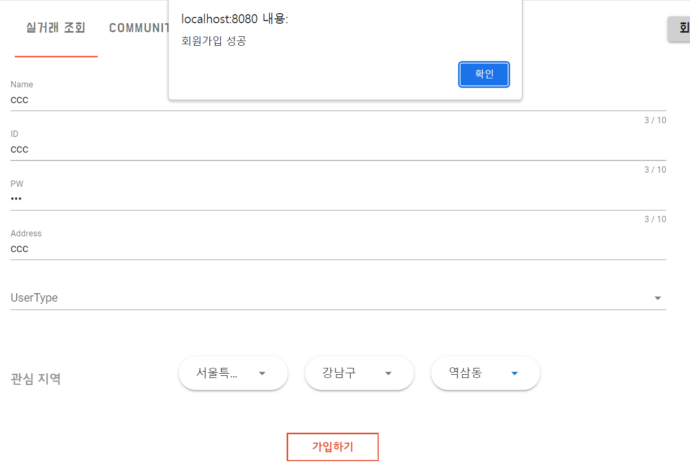
    
    - 회원 가입 시 기본 정보를 작성하고 네이버 뉴스 크롤링과, TOP3 아파트 상세 정보를 가져오는데 사용하기 위해 관심 지역 선택 추가
    - vuex로 비동기 처리하여 user테이블에 사용자를 insert한다.

```jsx
userSignUp({ commit }, user) {
      console.log(commit);
      /////////////////////vuex로 비동기처리
      console.log(JSON.stringify(user));
      http
        .post("user/signup", JSON.stringify(user))
        .then((resp) => {
          console.log(resp.data);
          if (resp.data === "success") {
            alert("회원가입 성공");
            router.push({ path: "/" });
          } else {
            alert("ID 또는 PW를 다시 확인해주세요.");
          }
        })
        .catch((error) => {
          console.log(error);
        });
    },
```

- **로그인**
    
    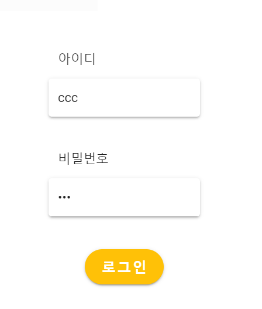
    
    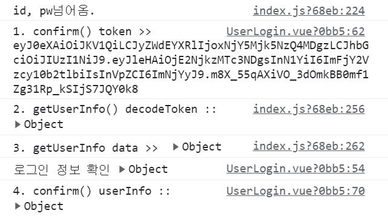
    
- JWT를 이용한 로그인
    - 로그인 창에서 가입한 ID와 PW로 로그인을 하면 vuex를 이용해 비동기로 ID와 PW를 확인한다.
    - UserController.java에서 확인 결과 ID와 PW가 일치하면 accessToken과 refreshToken을 발급해준다.

```java
// UserController.java의 login메소드
String accessToken = jwtService.createAccessToken("uid", loginUser.getUid());// key, data
String refreshToken = jwtService.createRefreshToken("uid", loginUser.getUid());// key, data
```

- Spring에서 넘겨준 accessToken과 refreshToken을 sessionStorage에 저장하여 새로 고침을 하여도 정해준 시간 동안은 로그인 상태를 유지하도록 해준다.
- 그 와 함께 SET_IS_LOGIN을 이용해 isLogin을 true로 바꿔 로그인 상태로 바꾼다.

```jsx
// store/index.js에서 
async userLogin({ commit }, user) {
      console.log("id, pw넘어옴.");
      await http
        .post("user/login?uid=" + user.uid + "&upw=" + user.upw)
        .then((resp) => {
          if (resp.data.message === "success") {
            let accessToken = resp.data["access-token"];
            let refreshToken = resp.data["refresh-token"];
            commit("SET_IS_LOGIN", true);
            commit("SET_IS_LOGIN_ERROR", false);
            commit("SET_IS_VALID_TOKEN", true);
            sessionStorage.setItem("access-token", accessToken);
            sessionStorage.setItem("refresh-token", refreshToken);
          } else {
            commit("SET_IS_LOGIN", false);
            commit("SET_IS_LOGIN_ERROR", true);
            commit("SET_IS_VALID_TOKEN", false);
          }
```

- isLogin이 true로 바뀐다면 vuex의 getUserInfo로 저장된 토큰을 보내 토큰이 유효한 지 확인을 한다.
- 토큰이 유효하다면 메인 페이지로 이동시킨다.

```java
if (this.isLogin) {
        await this.getUserInfo(token);
        this.$router.push({ path: "/" });
      }
```

- **마이 페이지**
    
    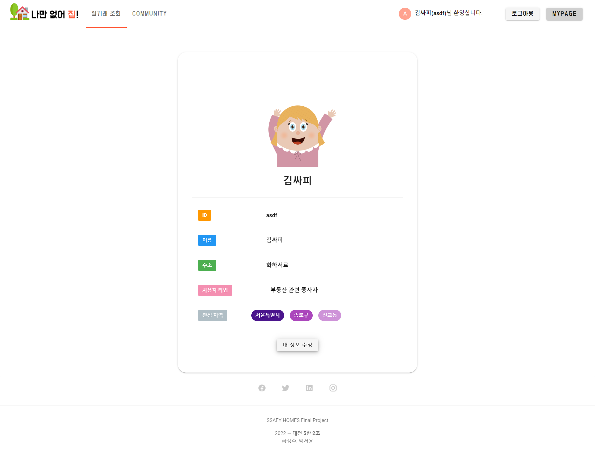
    
    - 로그인 후 myPage로 이동하면 회원 가입 시 작성했던 내용들이 보인다.
    - MyPage.vue에서 mapState를 import하여 state에 있는 userInfo 정보를 가져온다.
    - userInfo에 들어 있는 값들을 화면으로 보이게 구성한다.

```java
import { mapState } from "vuex";
export default {
  computed: {
    ...mapState(["userInfo"]),
  },
```

- **회원 정보 수정**
    
    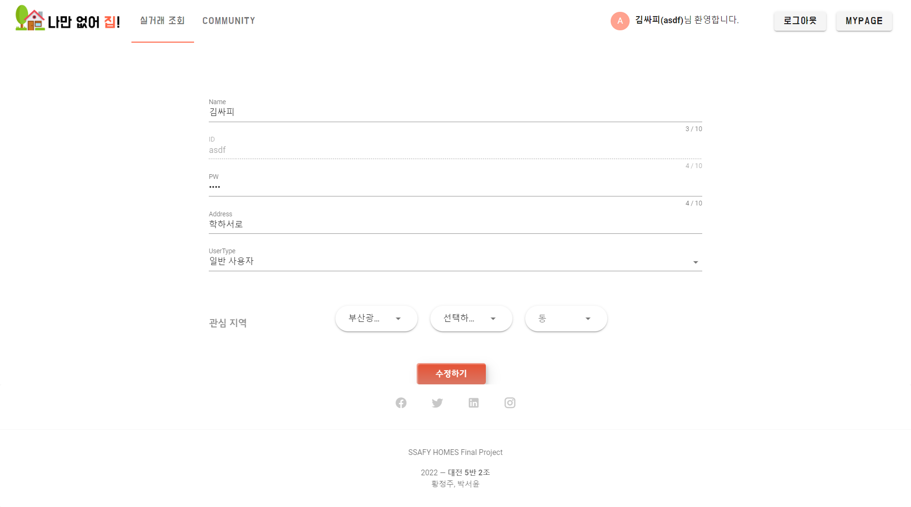
    

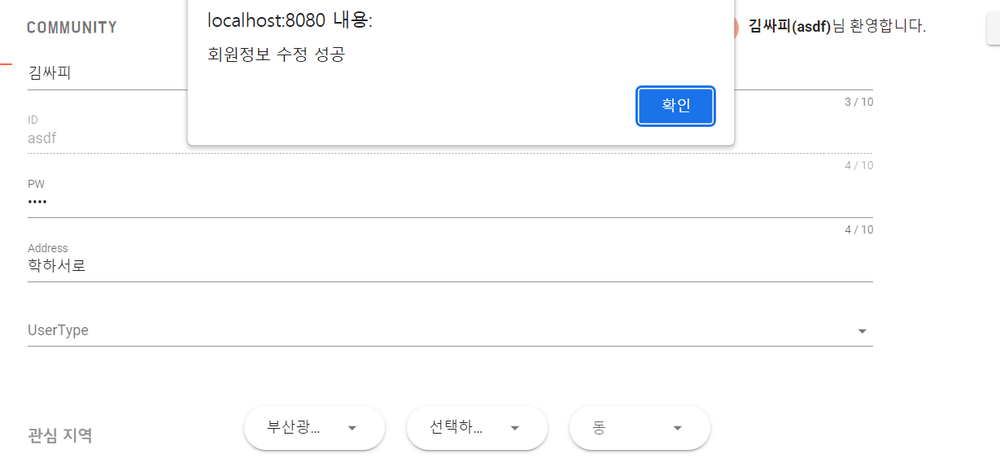

- 수정 페이지에서 수정할 데이터를 입력한 후에 수정하기 버튼을 누르면 vuex에서 먼저 commit을 하여 userInfo를 갱신해준다.
- 그 다음 PUT방식으로 비동기 통신하여 DB에 들어있는 user정보도 갱신을 해준다.

```java
async userModify({ commit }, payload) {
      console.log(payload);
      commit("SET_USER_INFO", payload);
      await http
        .put("user/modify", payload)
        .then((resp) => {
          console.log("응답", resp.data);
          if (resp.data == "success") {
            alert("회원정보 수정 성공");
            router.push({ path: "/user/myPage" });
          } else {
            alert("회원 정보를 다시 확인해주세요.");
          }
        })
        .catch((error) => {
          console.log(error);
        });
    },
```

### ✔️ board

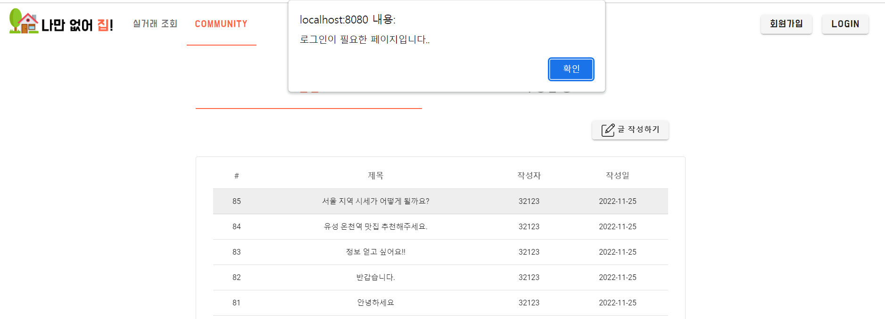

- userInfo가 null이 아닐 때에만 게시글 상세보기를 할 수 있도록 router/index.js 에 onlyAuthUser라는 변수를 만들어 준다.

```java
const onlyAuthUser = async (to, from, next) => {
  const checkUserInfo = store.getters["checkUserInfo"];
  const checkToken = store.getters["checkToken"];
  let token = sessionStorage.getItem("access-token");
  console.log("로그인 처리 전", checkUserInfo, token);

  if (checkUserInfo != null && token) {
    console.log("토큰 유효성 체크하러 가자!!!!");
    await store.dispatch("getUserInfo", token);
  }
  if (!checkToken || checkUserInfo === null) {
    alert("로그인이 필요한 페이지입니다..");
    // next({ name: "login" });
    router.push({ name: "userLogin" });
  } else {
    console.log("로그인 했다!!!!!!!!!!!!!.");
    next();
  }
};
```

- router/index.js에 게시글 상세보기(BoardListItem) path 지정 시에 beforeEnter 속성을 적용하여 로그인을 한 경우에만 접근할 수 있도록 하였다.

```java
{
        path: "view/:boardno",
        name: "boardListItem",
        beforeEnter: onlyAuthUser,
        component: BoardListItem,
      },
```

- **일반 게시판**
    
    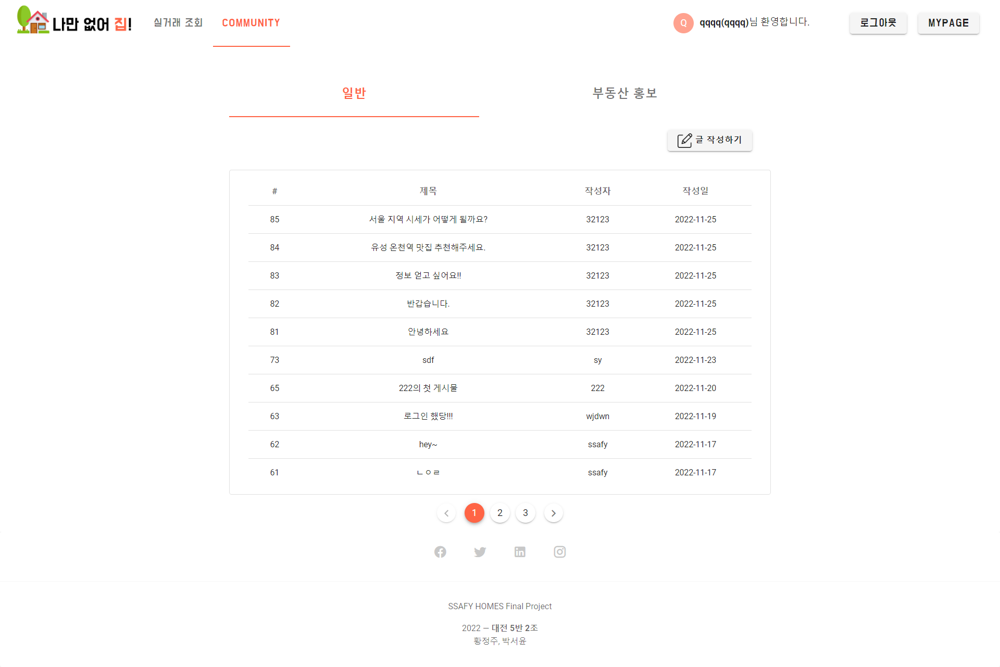
    
    - 모든 종류의 글을 작성하는 게시판
    - 게시글 작성, 조회
        - 모든 사용자 접근 가능
    - BoardList.vue에 접근하자마자 getBoard메소드를 실행하도록 created 에서 호출하여 boardType에 맞는 데이터들을 가져와서 보여준다.
    
    ```java
    getBoard(boardType, page) {
          let _this = this;
          console.log(boardType.content);
          axios({
            method: "get",
            url:
              "http://localhost:8888/homes/board/list?page=" +
              page +
              "&boardType=" +
              boardType.content,
          }).then((resp) => {
            console.log("BoardList Component created", resp.data);
            _this.boards = resp.data.boardList;
    
            _this.pages = {
              startPage: resp.data.startPage,
              totalPage: resp.data.totalPage,
              endPage: resp.data.endPage,
              currPage: resp.data.currPage,
            };
            // _this.pages = resp.date;
            console.log(_this.pages);
          });
        },
    ```
    
    - 글 작성하기 버튼을 누르면 CKEditor로 글을 작성할 수 있다.

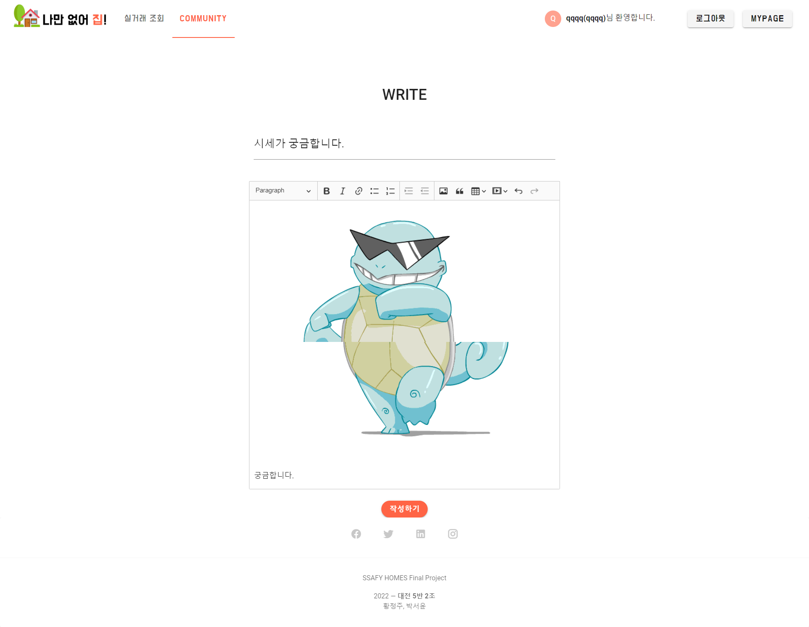

- CKFinder를 이용하여 사진 업로드 하자마자 바로 POST방식으로 사진이 업로드 되고 작성하기 버튼을 누르면 axios를 이용해 POST방식으로 DB에 저장된다.

```java
axios({
          method: "POST",
          url: "http://localhost:8888/homes/board/",
          data: {
            boardtype: this.$route.params.boardtype,
            boardtitle: _this.subject,
            boardwriter: this.userInfo.uid,
            boardcontent: _this.editorData,
          },
        }).then((resp) => {
          console.log("BoardList Component created", resp.data);
          this.$router.push({ path: "/board" });
        });
```

- 글 작성 후 본인이 적은 게시글만 수정, 삭제할 수 있는 버튼이 보이도록 하였다.

```java
<v-row
        class="d-flex flex-row-reverse mb-3"
        v-if="userInfo.uid == board.boardwriter"
      >
        <v-btn color="#FFA07A" outlined small fab dark class="ml-2" @click="boardDelete">
          <v-img src="@/assets/trash.png" width="20" height="100%"></v-img>
        </v-btn>

        <v-btn color="success" outlined small fab light @click="boardUpdate" 
					v-if="userInfo.uid == board.boardwriter">
          <v-img src="@/assets/wrench.png" width="20" height="100%"></v-img>
        </v-btn>
      </v-row>
```

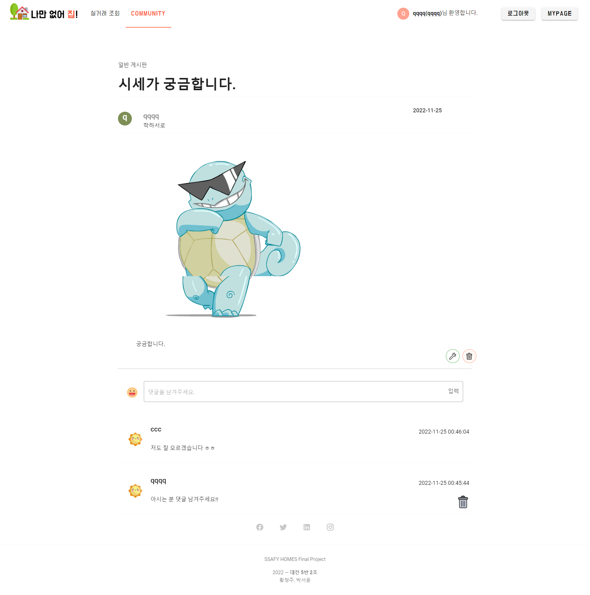


- **홍보 게시판**
    - 홍보 목적의 게시판
    
    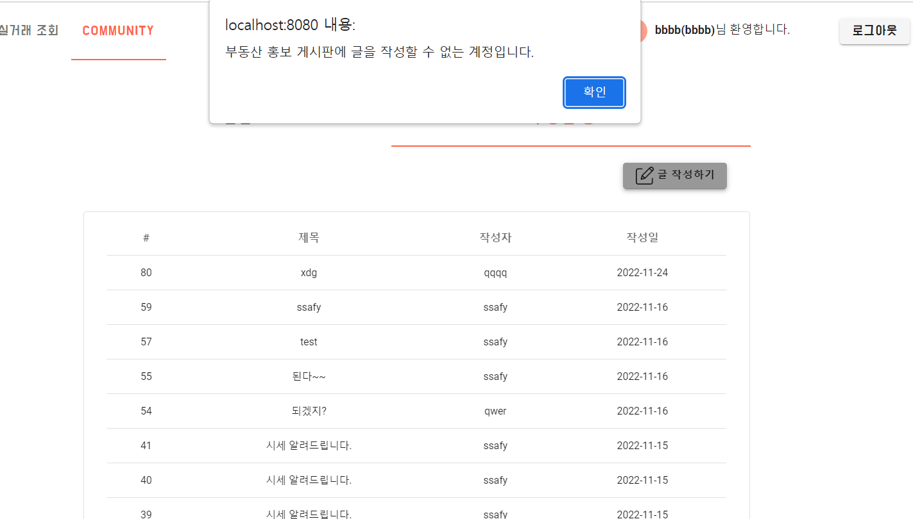
    
    - 게시글 조회는 모든 사용자가 가능하지만 글 작성은 User Type이 부동산 종사자(realEstate)인 경우에만 가능하도록 BoardList.vue에 적어주었다.
    
    ```java
    write(boardType) {
          /////boardType.content가 realEstate고 사용자 타입이 normal 인 경우 홍보 게시판에 글을 작성할 수 없도록 하기
          if (
            boardType.content == "realEstate" &&
            this.userInfo.utype != "realEstate"
          ) {
            alert("부동산 홍보 게시판에 글을 작성할 수 없는 계정입니다.");
          }
          /////////////boardType이 normal 이거나 부동산 관련 종사자이면서 boardType.content가 realEstate인 경우
          else {
            this.$router.push({ path: "/board/write/" + boardType.content });
          }
        },
    ```
