# 🚩프로젝트 소개

---

### ✔️ **프로젝트 명**

- 구해줘 홈즈(WhereIsMyHome): 전국 아파트 매매 실거래 조회 서비스

### ✔️ **프로젝트 설명**

- Spring Framework와 RestAPI를 활용하여 웹 서버를 구축하고 myBatis Framework를 활용하여 DB를 연동하는 프로젝트이다.

- 카카오 Map API와 공공 데이터 포털의 아파트 매매 실거래 데이터를 활용해 기능을 제공한다.

- 전국의 아파트 매매 실거래 내역 데이터를 관리하고, 사용자가 원하는 지역을 검색할 수 있도록 한다.

- 사용자가 선택한 지역(동)의 아파트 리스트를 지도와 함께 보여주고 아파트 이름을 클릭 시 아파트 상세정보와 매매 자료를 테이블 형태로 보여주며, 버튼을 누르면 네이버에서 아파트를 검색한 결과를 보여준다.

- 로그인을 해야만 게시판에 글을 적을 수 있으며, 사용자는 계정 정보를 수정, 삭제할 수 있다. 게시판 기능을 제공하여 서비스 이용자 간의 자유로운 커뮤니케이션이 가능하다.

### ✔️ **프로젝트 일정**

2022-11-02

### ✔️ **팀원**

- **[황정주](https://github.com/wjdwn03)**
- **[박서윤](https://github.com/seoyoon528)**

## 📌 목표

---

- Spring Framework와 RestAPI를 활용하여 웹 서버를 구축할 수 있다.
- myBatis Framework로 DB를 연동하여 유지보수성을 높일 수 있다.
- 요구 사항을 분석하고 DB 모델링을 할 수 있다.

## ⭐ 프로젝트 기능

---

### ✔️ 필수 구현 기능

1. **주택 실거래가 정보 수집**
    - `**house` DB를 생성한 후 houseinfo, housedeal, dongcode, user, board, interest_info 테이블을 생성한다.**
    - **국토교통부 매매 실거래가 정보 데이터 가공 후 DB 저장**
    - **“Controller - Service - Mapper - DTO”를 거쳐서 INSERT, UPDATE, SELECT, DELETE를 수행하고 그 결과를 DB에 적용시키거나 jsp를 통해 화면으로 보여준다.**
    
2. **주택 실거래가 검색**
    - **선택한 지역의 아파트 거래 정보 조회**
    
    - **초기 화면**
        
        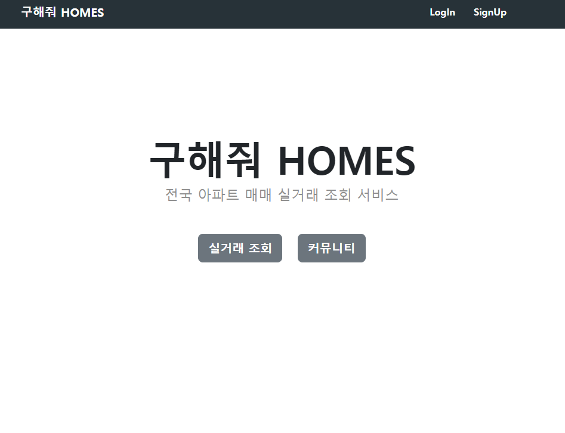
        
    
    - 실거래 조회 버튼 클릭시 실거래 조회 기능이 display 되며 페이지의 스크롤이 이동해 포커스가 하단 카카오 map으로 맞춰진다.
    
   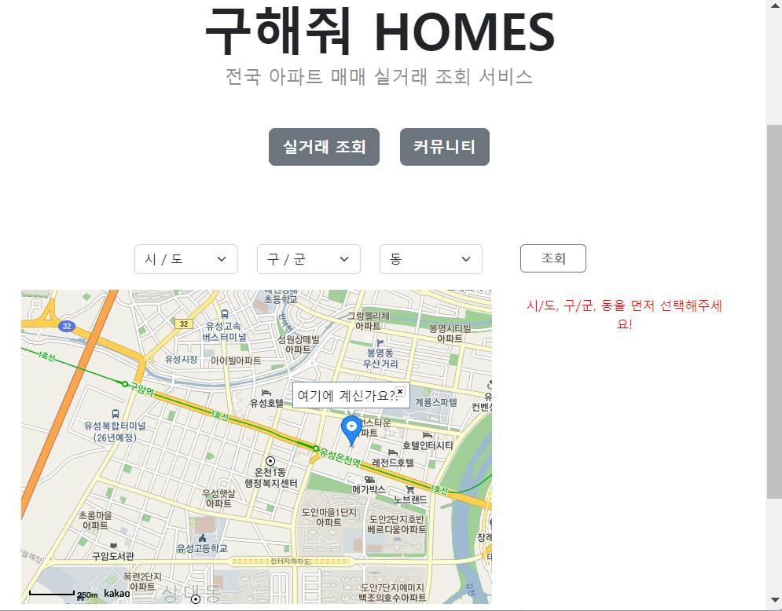
    
   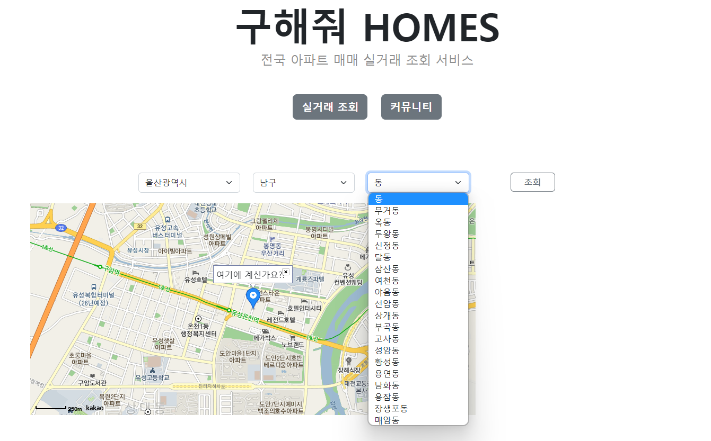
    
    - **`실거래조회(btnSearch)`를 클릭하자마자 비동기로 “시도” 정보를 가져온다.**
        
        → index.jsp에서 비동기 통신을 한다.
        
        → **HouseServlet(action=”sido”) - HouseService(getSido()) - HouseDao(getSido()) - DB(dongcode 테이블)** 순서대로 들어가서 “시도” 정보를 가져온다.
        
    - **“시도” 정보가 선택되면 선택된 값에 따라 “구군”정보를 가져온다.**
        
        → index.jsp에서 “시도”정보가 선택되면(change 이벤트 발생) 비동기 통신을 한다.
        
        → **HouseController(action=”gugun”) - HouseService(getGugun()) - HouseMapper(getGugun()) - DB(dongcode 테이블)** 순서대로 들어가서 “구군” 정보를 가져온다. 이때, 선택된 “시도” 값이 필요하기 때문에 파라미터로 넘겨줘야 한다.
        
    - **“구군” 정보가 선택되면 선택된 값에 따라 “동”정보를 가져온다.**
        
        → index.jsp에서 “구군”정보가 선택되면(change 이벤트 발생) 비동기 통신을 한다.
        
        → **HouseController(action=”dong”) - HouseService(getDong()) - HouseMapper(getDong()) - DB(dong 테이블)** 순서대로 들어가서 “동” 정보를 가져온다. 이때, 선택된 “시도” 값과 “구군”값이 필요하기 때문에 파라미터로 넘겨줘야 한다.
        
    - **“조회(getBtn)” 버튼을 누르면 비동기로 선택된 시, 구군, 동의 “아파트 목록”을 가져오고 카카오 map에 마커로 아파트 위치를 표시해준다.**
        
        → index.jsp에서 “조회(getBtn)” 버튼이 눌리면(click 이벤트 발생 ) 비동기 통신을 한다.
        
        → **HouseController(action=”list”) - HouseService(getApts()) - HouseMapper(getApts()) - DB(houseinfo 테이블)** 순서대로 들어가서 “아파트 목록”을 가져온다. 
        
        → 넘어온 아파트 목록을 리스트 형태로 보여준다.
        
 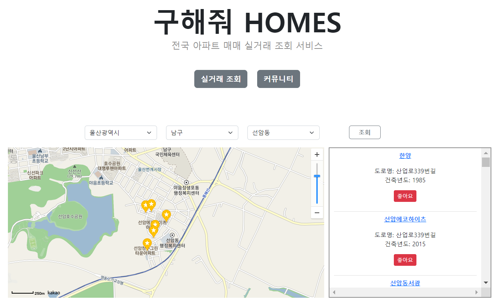
        
    
*  **아파트 명을 클릭하면 아파트 상세정보 페이지로 넘어가 houseinfo 테이블의 해당 aptCode를 가진 아파트의 상세정보를 불러온다.**

 ``` jsx
        async function readDetail() {
                console.log("${param.aptcode}");
                let response = await fetch("${root}/house/detail?aptcode=${param.aptcode}");
                let data = await response.json();
        
                // 아파트 정보	//
                document.getElementById("aptName").innerText = data.houseInfo.apartmentName;
                document.getElementById("aptBuildYear").innerText = data.houseInfo.buildYear;
                document.getElementById("aptSido").innerText = data.dongCode.sidoName;
                document.getElementById("aptGugun").innerText = data.dongCode.gugunName;
                document.getElementById("aptDong").innerText = data.dongCode.dongName;
                document.getElementById("aptRoadName").innerText = data.houseInfo.roadName;
                document.getElementById("naverSearch").href =
                  "https://search.naver.com/search.naver?where=nexearch&sm=top_hty&fbm=1&ie=utf8&query=" +
                  data.dongCode.sidoName +
                  " " +
                  data.dongCode.gugunName +
                  " " +
                  data.dongCode.dongName +
                  " " +
                  data.houseInfo.roadName;
 ```
        
    
*  **houseInfo에서 가져온 dongcode 데이터를 이용해 dongCode 테이블에서 아파트의 도로명 주소를 가져오며 dealList 테이블에서 전달받은 aptCode와 일치하는 아파트 매매 정보 목록을 모두 가져와 화면에 보여준다.**
        
 ```jsx
        // 매매 정보 List //
                let tbody = ``;
                let idx = 1;
                data.dealList.forEach(function (d) {
                  console.log(d);
                  tbody += `
                      <tr>
                        <th scope="row">\${idx}</th>
                        <td>\${d.floor}층</td>
                        <td>\${d.area}</td>
                        <td>\${d.dealAmount}</td>
                        <td>\${d.dealYear}.\${d.dealMonth}.\${d.dealDay}</td>
                      </tr>
                  `;
                  idx++;
                });
        
                document.querySelector("#dealList").innerHTML = tbody;
              }
```
        
    
*  **가져온 모든 데이터를 종합하여 아파트 이름, 건축년도, 도로명주소, 아파트 검색 버튼을 보여주고 해당 아파트의 거래 목록을 테이블로 보여준다.**
    
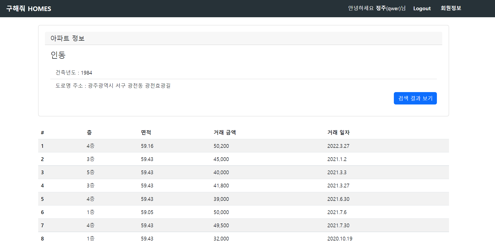
    

1. **회원 관리**
- **회원 가입**
    
→ 메인 페이지 상단의 SignUp버튼을 누르면 `UserController`에서 `signup.jsp`로 넘겨준다.
    
```java
    //회원가입
    	@GetMapping("/signup")
    	public String signup() {
    		return "signup";
    	} 
```
    
→”`**가입하기**`” 버튼을 누르면 signup.jsp에서 입력한 데이터들을 POST방식으로 UserController로 보내 “UserService-UserMapper-DB”를 거쳐서 user테이블에 insert하게 된다.
    
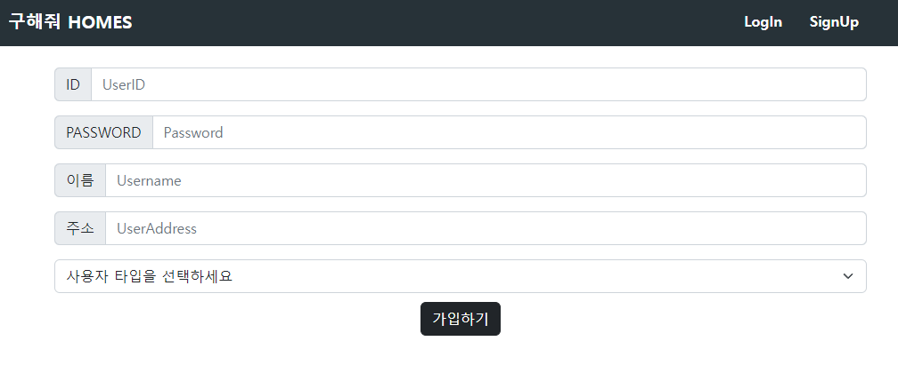
    

- **회원 정보 조회**
    
→ 로그인 후 페이지 우측 상단에 “회원 정보”를 누르면 `userdetail.jsp` 로 넘어간다.
    
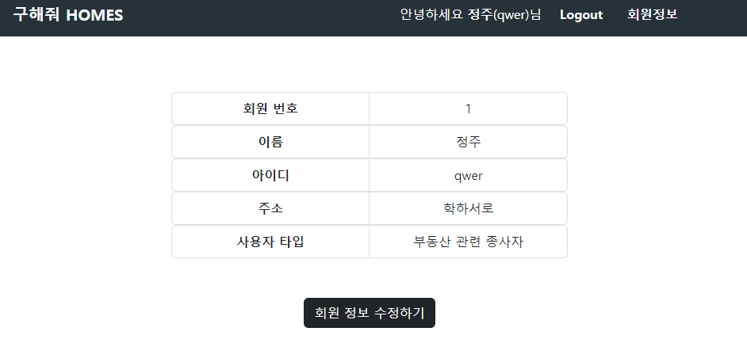
    
 → userdetail.jsp로 넘어가면 비동기로 회원 정보를 가져오고 가져온 데이터를 바로 화면에 보여준다.
    
```jsx
    async function getUserInfo(){
    		let resp = await fetch('${root}/user/userinfo?unum=${param.unum}');
    		let data = await resp.json();
    		
    		console.log(data.uid);
    		let unum = document.getElementById('unum');
    		unum.innerText = data.unum;
    
    		let uname = document.getElementById('uname');
    		uname.innerText = data.uname;
    		
    		let uid = document.getElementById('uid');
    		uid.innerText = data.uid;
    		console.log(uid);
    
    		let uaddr = document.getElementById('uaddr');
    		uaddr.innerText = data.uaddr;
    		
    		let utype = document.getElementById('utype');
    		if(data.utype=="normal"){
    			utype.innerText = "일반사용자";
    		}else{
    			utype.innerText = "부동산 관련 종사자";
    		}
    	}
    	getUserInfo();
```
    

- **회원 정보 수정**
    
→ `userdetail.jsp`에서 `**회원 정보 수정하기`** 버튼을 누르면 회원번호(unum)를 파라미터로 같이 넘겨주면서 userModify.jsp로 넘겨준다.
    
    `${root}/user/modify?unum=${loginUser.unum}`
    
```java
    //회원정보 수정 페이지로 넘기기
    	@GetMapping("/modify")
    	public String modify() {
    		return "userModify";
    	}
 ```
    
→ 이때 모든 회원은 비밀번호, 이름, 주소만 변경할 수 있도록 다른 항목들은 input 태그 안에 disabled처리해 준다.
    
    
 `<input type="text" name = "uid" aria-label="UserID" value="${loginUser.uid}" disabled/>`
    
→ UserMapper.xml에서 파라미터로 받은 unum과 같은 회원의 정보를 수정하므로 input태그에 hidden을 적용하여 데이터를 UserController-UserService-UserMapper-DB를 거쳐서 수정하도록 한다.
    
    `<input type="hidden" name="unum" value="${loginUser.unum}"/>`
    
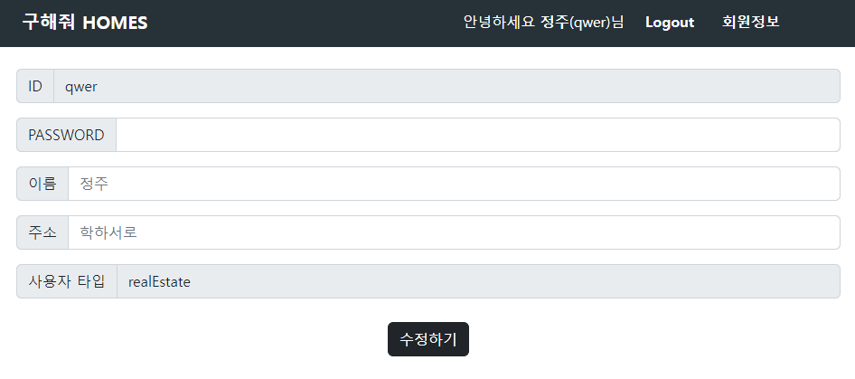
    
1. **로그인 관리**
    - **로그인/ 로그아웃**
    

    
→ 메인 화면에서 “LogIn”을 선택하면 아이디와 패스워드를 적을 수 있는 모달 창이 나온다.
    
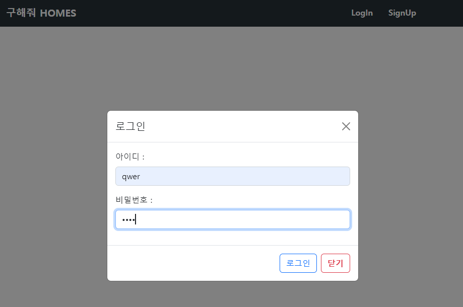
    
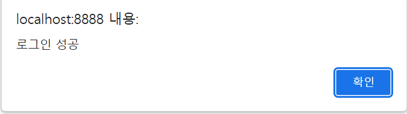
    
로그인에 성공하면 alert을 띄우고 nav bar 부분이 바뀌는 것을 확인할 수 있다.
    

    
```html
    <form action="${root}/user/login" method="post">
    <div class="modal fade" id="loginModal" data-bs-backdrop="static" tabindex="-1">
        <div class="modal-dialog modal-dialog-centered">
            <div class="modal-content">
            <div class="modal-header">
            <h5 class="modal-title">로그인</mark></h5>
            <button type="button" class="btn-close" data-bs-dismiss="modal" aria-label="Close"></button>
            </div>
            <div class="modal-body">

                <div class="mb-3">
                    <label for="uid" class="form-label">아이디 : </label>
                    <input
                    type="text"
                    class="form-control"
                    id="uid"
                    name="uid"
                    placeholder="아이디"
                    />
                </div>
                <div id="idcheck-result"></div>
                <div class="mb-3">
                    <label for="upw" class="form-label">비밀번호 : </label>
                    <input
                    type="password"
                    class="form-control"
                    id="upw"
                    name="upw"
                    placeholder="비밀번호"
                    />
                </div>
            </div>
            <div class="modal-footer">
            <button type="submit" id="btn-join" class="btn btn-outline-primary">로그인</button>
            <button type="button" class="btn btn-outline-danger" data-bs-dismiss="modal"><b>닫기</b></button>
            </div>
        </div>
        </div>
    </div>
    
</form>
 ```
    

### ✔️ 추가 구현 기능

1. **전체 게시판 / 홍보 게시판 기능**
    - 게시판 기능을 통해 서비스 이용자 간의 자유로운 커뮤니케이션이 가능하다.
    - 부동산 중개업자로 가입한 회원은 홍보 게시판에 홍보 글을 작성할 수 있다.
    - 로그인 한 회원이라면 누구나 게시판에 글을 작성할 수 있다.
    
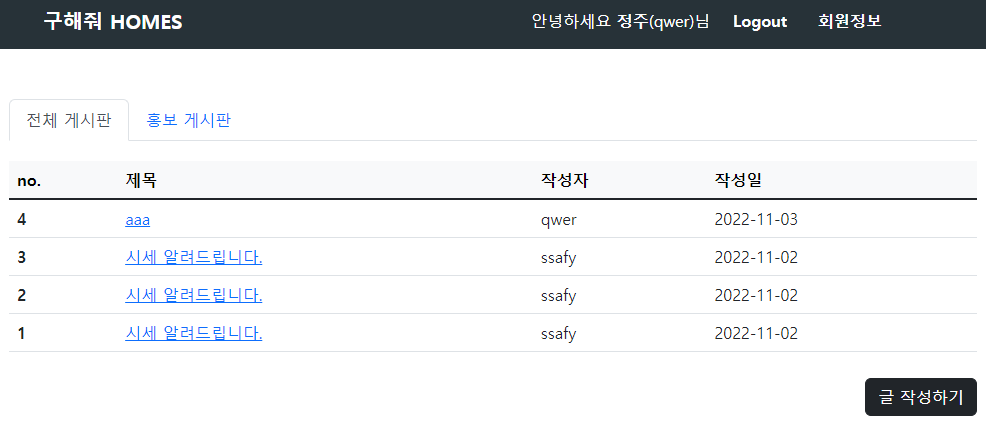
    
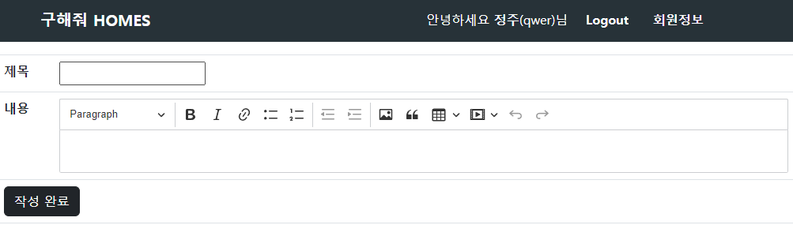
    

1. **네이버 검색 API 사용**
    - 아파트 상세정보 페이지에서 ‘검색 결과 보기‘ 버튼 클릭 시 네이버 검색창에 아파트의 도로명 주소가 자동으로 검색된다.
    - 사용자는 이를 이용해 아파트 주변의 환경 정보를 얻을 수 있다.

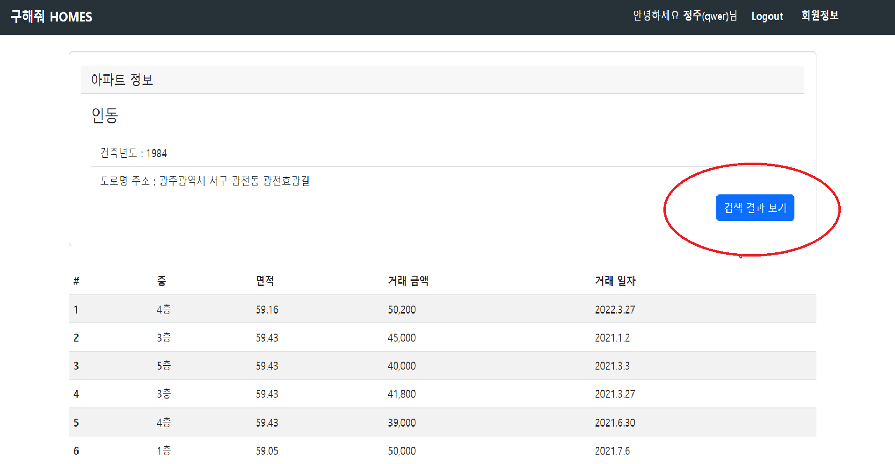

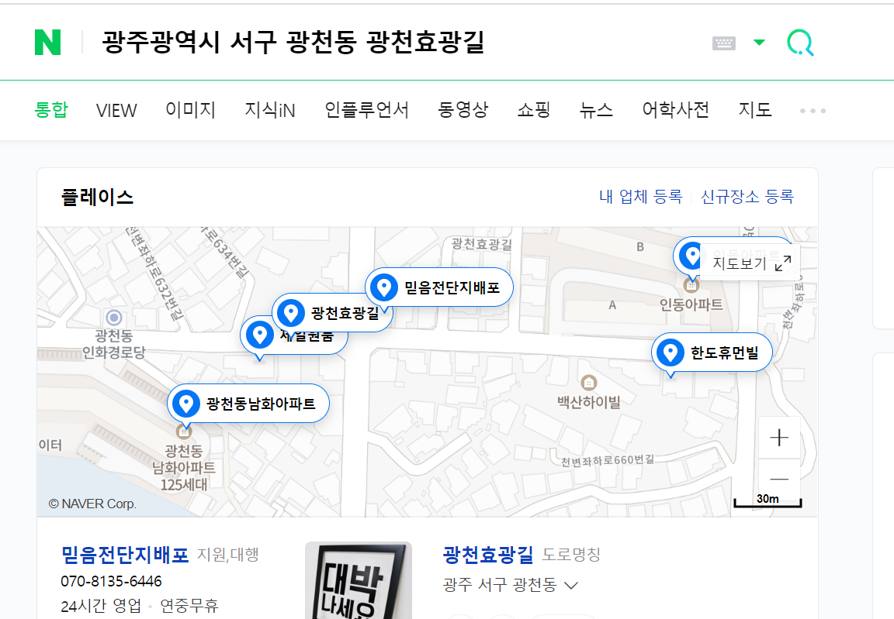

## 📡 사용한 API

---

- **국토교통부 아파트/ 연립다세대 실거래가 자료** - 공공 데이터 포탈
    
    ([https://www.data.go.kr/dataset/3050988/openapi.do](https://www.data.go.kr/dataset/3050988/openapi.do))
    

- **국토교통부_아파트매매 실거래 상세 자료** – 공공 데이터 포탈
    
    ([https://www.data.go.kr/iim/api/selectAPIAcountView.do](https://www.data.go.kr/iim/api/selectAPIAcountView.do))
    

## 💾 사용한 데이터베이스

---

- **[ houseinfo ]** - 아파트 정보 테이블
    
    
    |  | 아파트번호 | 건축년도 | 도로명 | 도로명본분 | 도로명부분 | 도로명seq | 도로명지번코드 | 도로명코드 | 동이름 | 본분 | 부분 | 시구군코드 | eubmyundongCode | 동코드 | 토지코드 | 아파트이름 | 지번 | 경도 | 위도 |
    | --- | --- | --- | --- | --- | --- | --- | --- | --- | --- | --- | --- | --- | --- | --- | --- | --- | --- | --- | --- |
    | 컬럼명 | aptCode | aptName | roadName | roadNameBonbun | roadNameBubun | roadNameSeq | roadNameBasementCode | roadNameCode | dong | bonbun | bubun | sigunguCode | eubmyundongCode | dongCode | landCode | apartmentName | jibun | lng | lat |
    | 데이터타입 | bigint | int | varchar(40) | varchar(5) | varchar(5) | varchar(2) | varchar(1) | varchar(7) | varchar(40) | varchar(4) | varchar(4) | varchar(5) | varchar(5) | varchar(10) | varchar(1) | varchar(40) | varchar(10) | varchar(30) | varchar(30) |
    | Constraint | primary key | default null | default null | default null | default null | default null | default null | default null | default null | default null | default null | default null | default null | default null | default null | default null | default null | default null | default null |
    |  |  |  |  |  |  |  |  |  |  |  |  |  |  | foreign key |  |  |  |  |  |
    |  |  |  |  |  |  |  |  |  |  |  |  |  |  |  |  |  |  |  |  |
    
    ```sql
    CREATE TABLE `houseinfo` (
      `aptCode` bigint NOT NULL,
      `buildYear` int DEFAULT NULL,
      `roadName` varchar(40) DEFAULT NULL,
      `roadNameBonbun` varchar(5) DEFAULT NULL,
      `roadNameBubun` varchar(5) DEFAULT NULL,
      `roadNameSeq` varchar(2) DEFAULT NULL,
      `roadNameBasementCode` varchar(1) DEFAULT NULL,
      `roadNameCode` varchar(7) DEFAULT NULL,
      `dong` varchar(40) DEFAULT NULL,
      `bonbun` varchar(4) DEFAULT NULL,
      `bubun` varchar(4) DEFAULT NULL,
      `sigunguCode` varchar(5) DEFAULT NULL,
      `eubmyundongCode` varchar(5) DEFAULT NULL,
      `dongCode` varchar(10) DEFAULT NULL,
      `landCode` varchar(1) DEFAULT NULL,
      `apartmentName` varchar(40) DEFAULT NULL,
      `jibun` varchar(10) DEFAULT NULL,
      `lng` varchar(30) DEFAULT NULL,
      `lat` varchar(30) DEFAULT NULL,
      PRIMARY KEY (`aptCode`),
      UNIQUE KEY `UNIQUE` (`buildYear`,`apartmentName`,`jibun`,`sigunguCode`,`eubmyundongCode`) /*!80000 INVISIBLE */,
      KEY `houseinfo_dongCode_dongcode_dongCode_fk_idx` (`dongCode`) /*!80000 INVISIBLE */,
      CONSTRAINT `houseinfo_dongCode_dongcode_dongCode_fk` FOREIGN KEY (`dongCode`) REFERENCES `dongcode` (`dongCode`)
    ) ENGINE=InnoDB DEFAULT CHARSET=utf8mb4 COLLATE=utf8mb4_0900_ai_ci;
    ```
    
- **[ housedeal ]** - 아파트 매매 정보 테이블
    
    
    |  | 매매번호 | 거래금액 | 거래년도 | 거래월 | 거래일 | 면적 | 층 |  | 아파트코드 |
    | --- | --- | --- | --- | --- | --- | --- | --- | --- | --- |
    | 컬럼명 | no | dealAmount | dealYear | dealMonth | dealDay | area | floor | cancelDealType | aptCode |
    | 데이터타입 | bigint | varchar(20) | int | int | int | varchar(20) | varchar(4) | varchar(1) | bigint |
    | Constraint |  |  |  |  |  |  |  |  | primary key |
    |  | default null | default null | default null | default null | default null | default null | default null | default null | default null |
    |  |  |  |  |  |  |  |  |  | foreign key |

```sql
CREATE TABLE `housedeal` (
  `no` bigint NOT NULL,
  `dealAmount` varchar(20) DEFAULT NULL,
  `dealYear` int DEFAULT NULL,
  `dealMonth` int DEFAULT NULL,
  `dealDay` int DEFAULT NULL,
  `area` varchar(20) DEFAULT NULL,
  `floor` varchar(4) DEFAULT NULL,
  `cancelDealType` varchar(1) DEFAULT NULL,
  `aptCode` bigint DEFAULT NULL,
  PRIMARY KEY (`no`),
  KEY `housedeal_aptCode_houseinfo_aptCode_fk_idx` (`aptCode`),
  CONSTRAINT `housedeal_aptCode_houseinfo_aptCode_fk` FOREIGN KEY (`aptCode`) REFERENCES `houseinfo` (`aptCode`)
) ENGINE=InnoDB DEFAULT CHARSET=utf8mb4 COLLATE=utf8mb4_0900_ai_ci;
```

- **[ dongcode]** - 전국의 동 코드
    
    
    |  | 동코드 | 시/도 이름 | 구/군 이름 | 동 이름 |
    | --- | --- | --- | --- | --- |
    | 컬럼명 | dongCode | sidoName | gugunName | dongName |
    | 데이터타입 | varchar(10) | varchar(30) | varchar(30) | varchar(30) |
    | Constraint | not null | default null | default null | default null |
    |  | primary key |  |  |  |
    
    ```sql
    CREATE TABLE `dongcode` (
      `dongCode` varchar(10) NOT NULL,
      `sidoName` varchar(30) DEFAULT NULL,
      `gugunName` varchar(30) DEFAULT NULL,
      `dongName` varchar(30) DEFAULT NULL,
      PRIMARY KEY (`dongCode`)
    ) ENGINE=InnoDB DEFAULT CHARSET=utf8mb4 COLLATE=utf8mb4_0900_ai_ci;
    ```
    

- **[ user ] -** 회원 정보 테이블
    
    
    |  | 회원번호 | 회원아이디 | 회원비밀번호 | 회원이름 | 회원주소 | 회원 타입 |
    | --- | --- | --- | --- | --- | --- | --- |
    | 컬럼명 | unum | uid | upw | uname | uaddr | utype |
    | 데이터타입 | int (auto_increment) | varchar(40) | varchar(40) | varchar(40) | varchar(40) | varchar(20) |
    | Constraint | primary key | unique  | not null | not null | not null | not null |
    |  |  | not null |  |  |  |  |
    
    ```sql
    create table user (
        unum int auto_increment primary key,
        uid varchar(40) unique not null,
        upw varchar(40) not null,
        uname varchar(40) not null,
        uaddr varchar(40) not null,
        utype varchar(20) not null
    );
    ```
    

- **[ board ]** - 게시판 테이블
    
    
    |  | 게시글번호 | 게시글 작성자 타입 | 게시글작성자 | 게시글제목 | 게시글내용 | 게시글작성일시 |
    | --- | --- | --- | --- | --- | --- | --- |
    | 컬럼명 | boardno | boardtype | boardwriter | boardtitle | boardcontent | boarddate |
    | 데이터타입 | int (auto_increment) | varchar(20) | varchar(20) | varchar(100) | varchar(200) | date |
    | Constraint | primary key | not null | foreign key (references userinfo(userid)) | not null | default null | not null |
    |  |  |  | on delete cascade |  |  |  |
    
    ```sql
    create table board (
        boardno int auto_increment,
        boardtype varchar(20) not null,
        boardwriter varchar(20) not null,
        boardtitle varchar(100) not null,
        boardcontent varchar(200) DEFAULT null,
        boarddate date not null,
        primary key (`boardno`),
        foreign key (`boardwriter`) references `user`(`uid`)
        on delete cascade
    );
    ```
    

## 🗂 프로젝트 구성

---

[ **주택 매매 실거래가 정보 ]**

- DTO
    - HouseInfoDTO.java
    - HouseDealDTO.java
    - DonCodeDTO.java
    - BaseAddressDTO.java
- DAO
    - HouseMapper.java
    - HouseMapper.xml
- Service
    - HouseService.java
- Controller
    - HouseController.java
- jsp
    - index.jsp
    - detail.jsp

**[ 사용자 정보 ]**

- DTO
    - UserDTO.java
- DAO
    - UserMapper.java
    - UserMapper.xml
- Service
    - UserService.java
- Controller
    - UserController.java
- jsp
    - signup.jsp
    - userdetail.jsp
    - userModify.jsp

**[ 게시판 ]**

- DTO
    - BoardDTO.java
- DAO
    - BoardMapper.java
    - BoardMapper.xml
- Service
    - BoardService.java
- Controller
    - BoardController.java
- jsp
    - boardList.jsp
    

**[ Config ]**

- DatabaseConfig.java

**[ include ]**

- header.jsp
- footer.jsp
- nav.jsp
